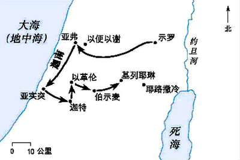

# 撒母耳记

## 背景
**作者**：撒母耳，25章后作者是拿单与迦得（代上29:29）  
撒母耳记在希伯来圣经中是一本书，七十士译本中为了方便将书分为上下两册  

**历史背景**：

	* 《士师记》中以色列的堕落（包括士师的堕落）
	* 《路得记》中为大卫出生的预备（堕落时代的清流）
	* 《撒母耳记》中祭祀的堕落

撒母耳作为最后一个士师并且是最大一个士师

	* 政治上结束了士师时代，开启了君王时代

撒母耳作为一个先知

	* 信仰上，神人之间的管道并不再依赖于祭祀系统，而更多的转向了特别拣选的先知

大卫作为主要角色

	* 救恩上，开始较为清晰的展现了救恩的计划（从大卫家所出）

**主题**：兴衰成败

	* 侍奉——以利家
	* 民族——以色列民与外邦民族
	* 君王（个人）——扫罗与大卫

**核心**：

	* 祷告：撒母耳的名字（神听见了；这是我促农耶和华那里求来的1:19-20）；全书通篇记载着各样人向神祈求的例子
	* 主权：成败兴衰全然在乎神（祷告的原因）

## 侍奉的成败（c1-c3）

［TODO］  
多妻制  
管教子女  
祷告  

## 民族的成败（c4-c7）

c4v1-v2 继续士师记的故事，以色列人与应许之地境内的外邦民族征战。  

c4v3-v5 

##
##
##
