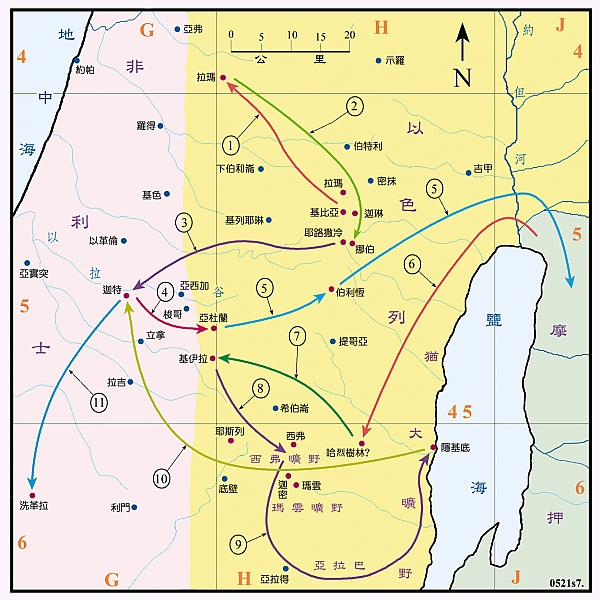

# 苦难中的征战

###### 图片来自[圣光神学院圣经地理资讯网](http://biblegeography.holylight.org.tw/)

1）c18v10-24 扫罗两次要刺杀大卫，又用计陷害他，他就逃往拉玛见撒母耳，扫罗也追去。
> v22-24 扫罗追赶大卫，但被神以受感说话的方式阻止了。

c20 约拿单和大卫结盟，并放大卫逃走
> v30-33 扫罗再次展示他对权力的贪恋，甚至不惜杀害自己的儿子

2) c21v1-9     大卫逃到挪伯，祭司亚希米勒给了他圣饼和歌利亚的刀。
> 欺骗亚希米勒

3) c21v10-15   大卫逃到非利士，投靠迦特王亚吉。
> 迦特：非利士人的城，歌利亚的故乡。大卫不惜逃到仇人的地方，可见扫罗对大卫的追杀有多么的凶。

> 装疯：“扫罗杀死千千，大卫杀死万万”，非利士人仍然记得当年的耻辱和仇恨。

4) c22v1-3   因怕迦特王害他，又逃往亚杜兰洞，他的家人和一些受逼迫的，都去跟随他。
> 大卫的一生的另一个需要关注的主题：3）对基督的预表

> 其他两个需要关注的主题：1）神使完事相互效力，最终使爱神的人得益处；2）忠心的仆人

> c2 在困境的都来投靠他：在罪的困境的我们要投靠耶稣！就有福了！

> 诗篇34、诗篇16

5) c22v3-5    大卫将父母送去摩押的米斯巴。

6) c22v5     大卫从摩押回犹大地，进入哈烈的树林。
> v6-10 以东人多益告密

> v11-19 虽然祭祀辩明自己无辜，但扫罗仍然残杀祭祀，并且屠城

> v20-23 神也借此让一个祭祀来到大卫的身边，使大卫更方便求问神

> 诗篇52

7) c23:1-6    非利士人攻击基伊拉，大卫前往营救。
> 逃难中不忘拯救神的百姓。以神为念的榜样。

> 馬太福音6:33 你們要先求他的國和他的義，這些東西都要加給你們了。

> 路加福音2:49 豈不知我應當以我父的事為念嗎？

8) c23:7-14   扫罗要攻打基伊拉，大卫逃到西弗的旷野。
> 扫罗却不是这样。他不救自己的百姓，反而攻打自己的百姓

> c14-16 扫罗寻不见大卫的踪迹，约拿单轻易就寻见了

> c14 扫罗寻所大卫不可谓不尽心竭力，但神却保护大卫

> c19-24 再次遭遇背叛告密
>> 诗篇54 

> c23 扫罗服事自己是如此的尽心竭力，我们是否也是如此服事神的？

9) c23v24-24:7  大卫逃避扫罗的追杀，从西弗旷野、经亚拉巴、玛云的旷野，到了隐基底的山寨。
> c23v25-29 大卫已如瓮中之鳖的情况下，神接着扫罗对国位的贪求和非利士人的手，将大卫救出

> v28 西拉哈玛希罗结：分隔之磐石、逃脱之绝壁

> c24v1 再次遭遇告密
>> 诗篇142，诗篇57

> c24v2-7 扫罗追至隐基底的旷野中的山洞大解时，大卫只割下扫罗的衣襟而未杀他。

> 罗马书 12:19-21亲爱的弟兄，不要自己伸冤，宁可让步，听凭主怒（或作“让人发怒”）。因为经上记着：“主说，伸冤在我，我必报应。”
所以，“你的仇敌若饿了，就给他吃；若渴了，就给他喝。因为你这样行，就是把炭火堆在他的头上。”你不可为恶所胜，反要以善胜恶。 

> v8-22 大卫与扫罗的对话，立约。日后扫罗却没有守约。

*） c25v1 撒母耳去世

*） c25 大卫和亚比该
> v13，21-22 对比大卫对待拿八的态度和之前对待扫罗的态度，可以发现大卫虽然通过了大的试炼，但却在这个小的试炼中失败了。
> 在大事上大卫愿意等候耶和华，但在小事上却因着血气想要自己伸冤。

> v30-33 但神就借着贤德的亚比该平息了大卫的愤怒。

> v39 当大卫等候的时候，神也就为大卫伸冤
>> 詩篇25:3 凡等候你的必不羞愧

>> 耶利米哀歌3:25-26 凡等候耶和華，心裡尋求他的，耶和華必施恩給他。人仰望耶和華，靜默等候他的救恩，這原是好的。

> v40-42 大卫得到一个贤德的妻子

*） c26 大卫又在西弗的旷野，夜间偷进扫罗的帐中，只取去他的枪和水瓶，也没有杀他

10）c27v3-6  大卫去投靠非利士的迦特王亚吉，亚吉将洗革拉赐给他。
> v8-12 神就借着这段时间来扫平以色列周边的祸患
> 历上c12 并且扩增大卫的势力

c28 非利士人再次侵扰以色列人，扫罗交鬼

c29 非利士人不信任大卫，免了他的窘境

c30 大卫也因此有机会可以救回自己和同伴的家小财物

c31 也因着这次征战，神夺了扫罗的国位，准备交给大卫